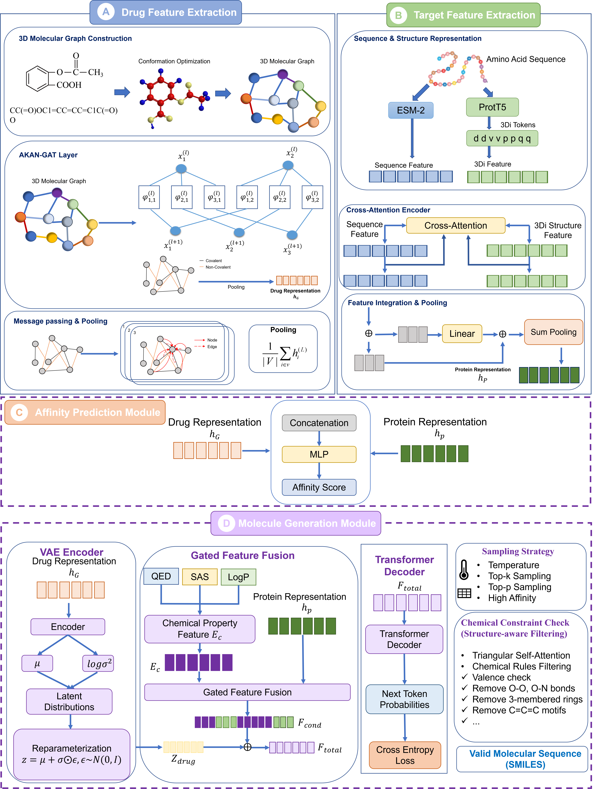

## Unified Drug–Target Affinity Prediction and Molecular Generation via Multimodal Learning


## UniDTA-Gen
<div align="center">  

</div>

## Setup and dependencies
#### Dependencies:
```
- python 3.8
- pytorch 1.12.1
- autogluon 0.5.2
- dill 0.3.4
- fair_esm 2.0.0
- joblib 1.1.0
- numpy 1.21.2
- pandas 1.3.5
- rdkit 2022.9.5
- setuptools 59.8.0
- tqdm 4.62.2
```

#### Conda environment
```bash
# Run the commandline
conda create -n Unidta-gen python=3.8 -y
conda activate Unidta-gen
conda install pytorch==1.12.1 torchvision==0.13.1 torchaudio==0.12.1 cudatoolkit=11.3 -c pytorch -y
```

## Data sets

This repository contains four benchmark datasets, namely Parasite, Davis, KIBA, and BindingDB, which are used for two prediction tasks: drug-target affinity (DTA) prediction and molecular generation.

## Data and Model Weights

All processed data and pre-trained model weights are available at [Zenodo](https://doi.org/10.5281/zenodo.20539924).

## Training and Testing on Your Own Dataset

To train and evaluate the model on your custom dataset, please follow the steps below:

1. Run `esm_feature.py` to extract sequence-level features of the proteins.
2. Run `3di_seq.py` to obtain the 3Di tokens of the proteins, then run `3di_feature.py` to extract the 3Di structural features.
3. Run `get_vocabs.py` to build the vocabulary files.
4. Run `add_properties.py` to compute and append the chemical properties of the molecules.
5. Run `build_save_graphs.py` to construct and save the graph-structured representations of the molecules.

## Pre-trained Models

- **ESM-2** ([facebookresearch/esm](https://github.com/facebookresearch/esm)) was employed for protein sequence encoding.
- **ProstT5** ([Rostlab/ProstT5](https://huggingface.co/Rostlab/ProstT5)) was employed for structure-aware representation learning.

## Training

Starting a new training run:
```bash
python training_validation.py <task> <dataset> <experimental setting>
```
The options for task include dti, dta, and moa, the options for dataset include yamanishi_08, hetionet, davis, kiba, activation, and inhibition, and the options for experimental setting include warm_start, drug_coldstart, and protein_coldstart.

For example, in moa task, using activation dataset and warm_start setting, run:
```bash
python training_validation.py moa activation warm_start
```

And in dti task, using yamanishi_08 dataset and protein_coldstart setting, run:
```bash
python training_validation.py dti yamanishi_08 protein_coldstart
```

And so on.
