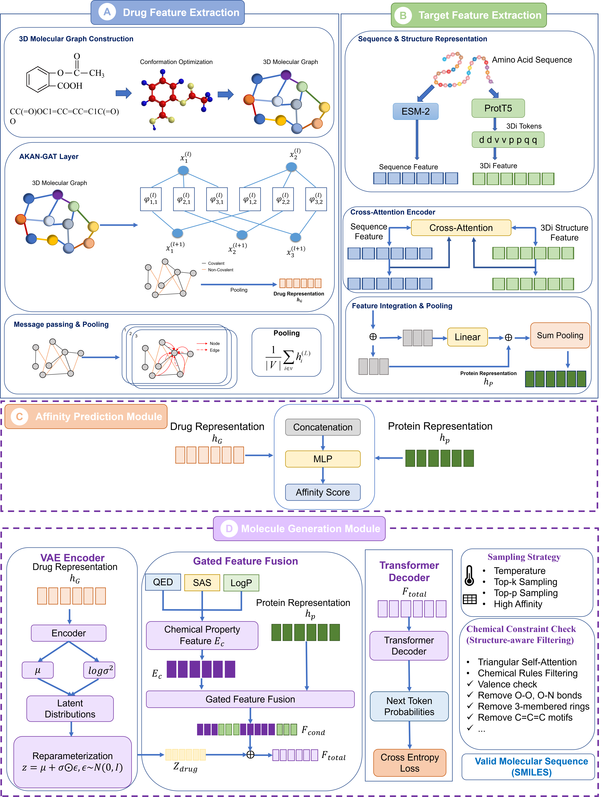

## Unified Drug–Target Affinity Prediction and Molecular Generation via Multimodal Learning


## UniDTA-Gen
<div align="center">  

</div>

## Setup

Tested with Python 3.8.20, PyTorch 2.1.0 (CUDA 11.8).

```bash
conda create -n unidta-gen python=3.8 -y
conda activate unidta-gen
conda install pytorch==2.1.0 torchvision==0.16.0 torchaudio==2.1.0 pytorch-cuda=11.8 -c pytorch -c nvidia -y
```

Then install the remaining dependencies:

```bash
pip install dgl==2.4.0+cu118 -f https://data.dgl.ai/wheels/torch-2.1/cu118/repo.html
pip install fairseq==0.10.2
pip install fair-esm==2.0.0
pip install transformers==4.46.3
pip install jarvis-tools==2023.12.12 networkx==3.1 scikit-learn==1.3.2 scipy==1.10.1
pip install rdkit==2024.3.5
pip install numpy==1.23.5 pandas==1.3.5 tqdm==4.63.0
pip install sentencepiece protobuf
```

## Data sets

This repository contains four benchmark datasets, namely Parasite, Davis, KIBA, and BindingDB, which are used for two prediction tasks: drug-target affinity (DTA) prediction and molecular generation.

## Data and Model Weights

All processed data and pre-trained model weights are available at [Zenodo](https://doi.org/10.5281/zenodo.20539924).

## Training and Testing on Your Own Dataset

To train and evaluate the model on your custom dataset, please follow the steps below:

1. Run `esm_feature.py` to extract sequence-level features of the proteins.
2. Run `3di_seq.py` to obtain the 3Di tokens of the proteins, then run `3di_feature.py` to extract the 3Di structural features.
3. Run `get_vocabs.py` to build the vocabulary files.
4. Run `add_properties.py` to compute and append the chemical properties of the molecules.
5. Run `build_save_graphs.py` to construct and save the graph-structured representations of the molecules.

## Pre-trained Models

- **ESM-2** ([facebookresearch/esm](https://github.com/facebookresearch/esm)) was employed for protein sequence encoding.
- **ProstT5** ([Rostlab/ProstT5](https://huggingface.co/Rostlab/ProstT5)) was employed for structure-aware representation learning.

## Repository layout

```text
.
├── main.py                    # training entry point
├── model.py                   # KA_GAT, DrugGenModel, ProteinFeatureExtractor, ...
├── utils.py                   # DataSet, collate_fn, Tokenizer, metrics
├── Pre_DTA.py                 # DTA inference
├── Pre_Gen.py                 # molecule generation
├── generation_eveluation.py   # validity / uniqueness / novelty
├── Radam.py / lookahead.py    # optimizers
└── data_process/
    ├── esm_feature.py         # ESM-2 sequence features
    ├── 3di_seq.py             # ProstT5 -> 3Di token sequences
    ├── 3di_feature.py         # ProstT5 3Di features
    ├── get_vocabs.py          # build SMILES tokenizer
    ├── add_properties.py      # QED / logP / SAS
    └── build_save_graphs.py   # build DGL molecular graphs
```

Expected data layout for a dataset `{dataset}` (e.g. `parasite`, `davis`, `kiba`, `bindingdb`):

```text
{dataset}/
├── {dataset}_dataset.csv              # raw: Drug, Target, target_key, Y
├── {dataset}_dataset_with_3di.csv     # + 3di_sequence, qed, logp, sas
├── {dataset}_tokenizer.pkl
├── esm2/{target_key}.pt
├── 3di_embeddings/{target_key}.pt
├── saved_graphs/{dataset}_graphs.pkl
└── data_folds/{start_set}/{fold}/     # train.csv, test.csv
```


## Training

Starting a new training run:
```bash
python main.py 
```
Use the model weights for prediction by running `Pre_DTA.py`.

Use the model weights for molecular generation by running `Pre_Gen.py`.

And so on.
